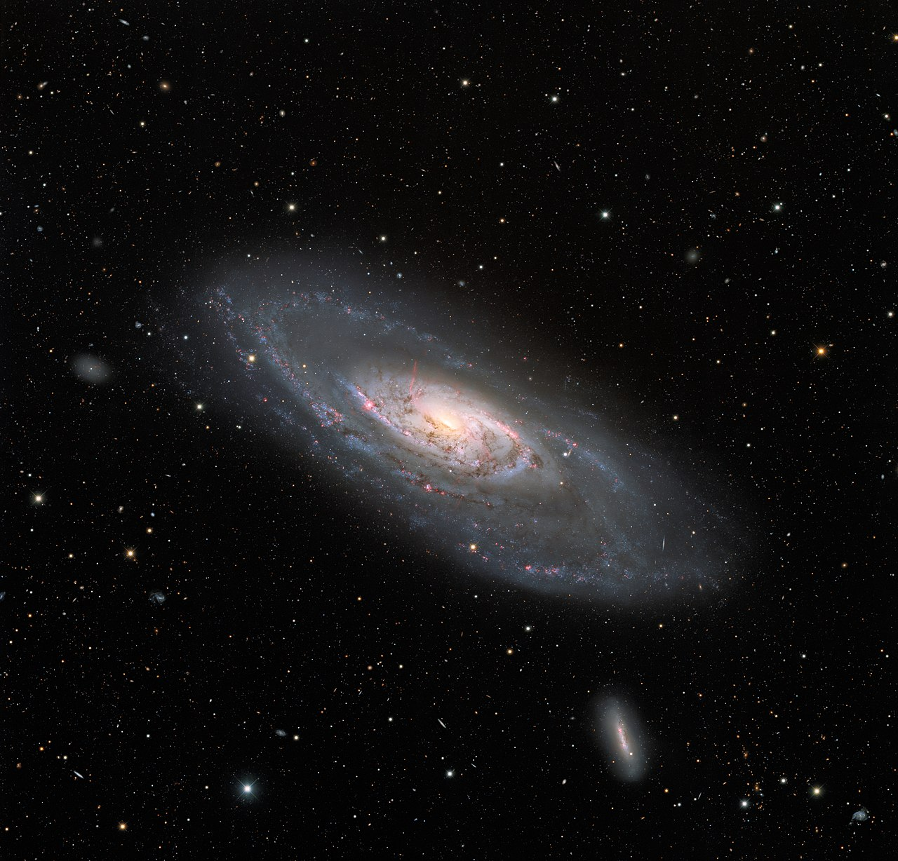

From: KPNO/NOIRLab/NSF/AURAAcknowledgment:PI: M.T. Patterson (New Mexico State University)Image processing: T.A. Rector (University of Alaska Anchorage), M. Zamani & D. de Martin - https://noirlab.edu/public/images/noirlab2112b/, CC BY 4.0, https://commons.wikimedia.org/w/index.php?curid=112476937

 
 

# **A**rtificial **N**eural **N**etworks Framework for Visual Programming -106
A framework for artificial neuro networks for educational purposes.

With a visual modular system to build your AI:
- GUI / visual programming with nodes
- Export as python code
- NN training
- NN inferencing
- Visual Programmed NN exporting und importing
- tensorflow or pytorch for training/inferencing and export/import
- Famous NN as blueprint?
- Dataimport -> Preparation?

